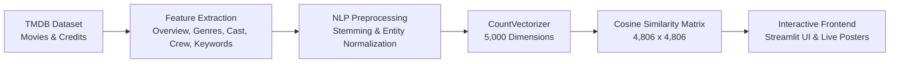

<div align="center">

# 🎬 CineMatch — AI Movie Recommender System

[](https://www.python.org/)
[](https://streamlit.io/)
[](https://scikit-learn.org/)
[](https://pandas.pydata.org/)
[](https://github.com/Aniketsingh-45/movie_recommanding_system)
[](LICENSE)

*An intelligent, content-based movie recommendation engine featuring a modern, dark cinematic interface, real-time poster retrieval, interactive similarity analytics, and vector space NLP filtering.*

---

</div>

## 🌟 Key Highlights

- **🎯 Content-Based NLP Filtering**: Recommends movies using Cosine Similarity calculated over a 5,000-dimensional Bag-of-Words vector space.
- **🖼️ Real-Time Poster & Metadata Fetching**: Live integration with OMDb and TMDb APIs to display official movie posters, IMDb ratings, release years, directors, and plot synopses.
- **🎬 Selected Movie Spotlight**: Instant preview card showcasing details of your selected movie before generating recommendations.
- **🎲 Surprise Me Mode**: Random movie discovery button to quickly explore titles from the 4,800+ indexed movie collection.
- **📊 Interactive Similarity Analytics**: Visual Altair bar charts comparing the cosine similarity match percentage across all recommended titles.
- **⚙️ Configurable Recommendations**: Choose between 4 and 10 recommendations on the fly using the interactive sidebar slider.
- **⚡ Smart In-Memory Caching**: Powered by Streamlit's `@st.cache_data` and `@st.cache_resource` for zero-latency repeats.
- **🎨 Glassmorphic Cinematic UI**: Custom dark theme styling with card elevation, hover zoom animations, and responsive layouts.

---

## 📸 Interface Preview

<div align="center">
  <blockquote>
    Select any movie from the collection, view its details, and instantly receive top visual recommendations with match percentages and story synopses.
  </blockquote>
</div>

---

## 🧠 How the Recommendation Engine Works

CineMatch uses **Content-Based Filtering** built on the **TMDB 5000 Movies & Credits** datasets:



1. **Feature Merging**: Combines `overview`, `genres`, `keywords`, top 3 `cast` members, and the `director` into a consolidated `tags` string.
2. **Entity Joining**: Multi-word names are transformed (e.g., `"James Cameron"` $\rightarrow$ `"jamescameron"`) to distinguish between individuals with common names.
3. **Stemming**: Applies NLTK's `PorterStemmer` to map morphological variations of words to root forms (e.g., `"actions"`, `"acting"` $\rightarrow$ `"action"`).
4. **Vectorization**: Uses `CountVectorizer(max_features=5000, stop_words='english')` to construct sparse frequency vectors.
5. **Distance Metric**: Measures the cosine of the angle between vectors:

$$\text{Cosine Similarity}(u, v) = \frac{u \cdot v}{\|u\| \|v\|}$$

---

## 🗂️ Project Structure

```bash
movie_recommanding_system/
├── app.py                         # Main Streamlit interactive web application
├── movie_recomader_system.ipynb   # Jupyter Notebook containing data preprocessing & model generation
├── movies.pkl                     # Processed movies DataFrame (ID, Title, Tags)
├── similarity.pkl                 # Precomputed Cosine Similarity matrix (local / Git LFS)
├── requirements.txt               # Python package dependencies
├── .gitignore                     # Files and directories excluded from Git tracking
└── README.md                      # Project documentation and guide
```

---

## 🚀 Quick Start & Installation

### 1. Clone the Repository
```bash
git clone https://github.com/Aniketsingh-45/movie_recommanding_system.git
cd movie_recommanding_system
```

### 2. Create and Activate a Virtual Environment

**On Windows:**
```powershell
python -m venv venv
.\venv\Scripts\activate
```

**On macOS / Linux:**
```bash
python3 -m venv venv
source venv/bin/activate
```

### 3. Install Dependencies
```bash
pip install -r requirements.txt
```

### 4. Similarity Matrix & Model Files

- `movies.pkl` is included directly in the repository.
- `similarity.pkl` (~184 MB) exceeds GitHub's standard 100 MB upload limit. If you need to generate `similarity.pkl`:
  1. Open and run the included notebook [movie_recomader_system.ipynb](movie_recomader_system.ipynb).
  2. It will process the dataset and export both `movies.pkl` and `similarity.pkl` directly to your project directory.

### 5. Launch the Streamlit App
```bash
streamlit run app.py
```

The application will launch in your default web browser at `http://localhost:8501`.

---

## 🛠️ Technology Stack

| Component | Technologies |
|---|---|
| **Frontend UI** | [Streamlit](https://streamlit.io/), [Altair](https://altair-viz.github.io/), Vanilla CSS (Glassmorphism) |
| **Machine Learning** | [Scikit-Learn](https://scikit-learn.org/) (CountVectorizer, Cosine Similarity) |
| **Data Processing** | [Pandas](https://pandas.pydata.org/), [NumPy](https://numpy.org/) |
| **Natural Language Processing** | [NLTK](https://www.nltk.org/) (PorterStemmer) |
| **Poster & Metadata API** | [OMDb API](https://www.omdbapi.com/) & [TMDb API](https://www.themoviedb.org/) |
| **Serialization** | Python `pickle` |

---

## 💡 Troubleshooting & FAQ

<details>
<summary><b>Why are TMDB API poster requests failing or timing out?</b></summary>
<p>
Certain Internet Service Providers (notably in India) block or route DNS queries for <code>api.themoviedb.org</code> incorrectly. CineMatch solves this by prioritizing the <b>OMDb API</b> (backed by Amazon CloudFront CDN), guaranteeing ultra-fast and reliable poster delivery without network blocks.
</p>
</details>

<details>
<summary><b>How can I add more movies to the system?</b></summary>
<p>
You can append newer movie records (with genres, keywords, cast, and crew) to the TMDB CSV files and re-run the pipeline in <code>movie_recomader_system.ipynb</code> to generate updated pickle artifacts.
</p>
</details>

---

## 🤝 Contributing

Contributions, feedback, and star ratings are welcome!
1. Fork the repository
2. Create your feature branch (`git checkout -b feature/AmazingFeature`)
3. Commit your changes (`git commit -m "Add AmazingFeature"`)
4. Push to the branch (`git push origin feature/AmazingFeature`)
5. Open a Pull Request

---

## 📄 License

Distributed under the MIT License. See `LICENSE` for more information.

---

<div align="center">
  Developed by <a href="https://github.com/Aniketsingh-45">Aniket Singh</a>
</div>
